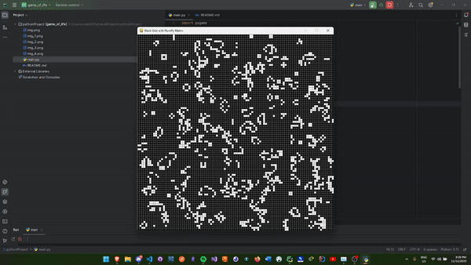

# Game of Life



This is an implementation of John Conway's Game of Life written in Python using the Pygame library. The Game of Life is a cellular automaton devised by the British mathematician John Horton Conway in 1970. It consists of a grid of cells which, based on a few mathematical rules, can live, die or multiply. The path of the game is determined by the initial state, requiring no further input from the user.

## Prerequisites

Before running this program, you must have the following installed:
- Python 3.x
- Pygame

You can install Pygame using pip:
```shell
pip install pygame
```
## Running the Program

To run the program, navigate to the directory containing `main.py` and execute the following command:
```shell
python main.py
```

## Rules

The universe of the Game of Life is an infinite, two-dimensional orthogonal grid of square cells, each of which is in one of two possible states:
- Alive (White)
- Dead (Black)

Every cell interacts with its eight neighbors, which are the cells that are horizontally, vertically, or diagonally adjacent.

At each step in time, the following transitions occur:
1. Any live cell with fewer than two live neighbors dies (referred to as underpopulation).
2. Any live cell with two or three live neighbors lives on to the next generation.
3. Any live cell with more than three live neighbors dies (referred to as overpopulation).
4. Any dead cell with exactly three live neighbors becomes a live cell (referred to as reproduction).